# SWAMP Onboarding Tutorial

SWAMP (the Software Assurance Marketplace) is a hosted service that uses large
language models to scan source code for security issues and produce a
structured findings report. This tutorial walks through a complete first-time
workflow: creating an account, registering a Git repository as a _package_,
and running an AI-driven security analysis against it. The repository we use
here — [CHTC/vulnerable-app](https://github.com/CHTC/vulnerable-app) — is a
deliberately insecure Python web application, which makes it a good target
for confirming that the analysis pipeline works end-to-end and is actually
finding real issues.

By the end of the tutorial you will have:

- A SWAMP account linked to your home institution via CILogon
- A project to organize related packages and analyses
- The vulnerable-app repository registered as a package
- A completed analysis with findings you can review in the UI

## Prerequisites

Before you start, make sure you have the following:

- **A federated identity usable with CILogon.** SWAMP does not manage its own
  passwords; instead it federates login through
  [CILogon](https://cilogon.org). Most US university logins, ORCID, and
  GitHub work. You will be asked to pick your identity provider during sign
  in.
- **An LLM provider key (or access to one).** Analyses are run by a language
  model, so SWAMP needs credentials for at least one provider (for example
  an Anthropic API key, an NRP / ACCESS token, or a custom OpenAI-compatible
  endpoint). If your project inherits a shared key from a group you belong
  to, you can skip the provider-setup step. Otherwise you will add a key in
  step 5.
- **A Git repository URL to analyze.** This tutorial uses the public
  `https://github.com/CHTC/vulnerable-app.git`, so nothing else is required
  for the example. If you later bring your own repository, make sure it is
  either public or that you have arranged read access for SWAMP.

## 1. Open SWAMP and start sign-in

Open the SWAMP landing page. The landing page is informational — no data is
stored until you sign in — and it links to the login flow.

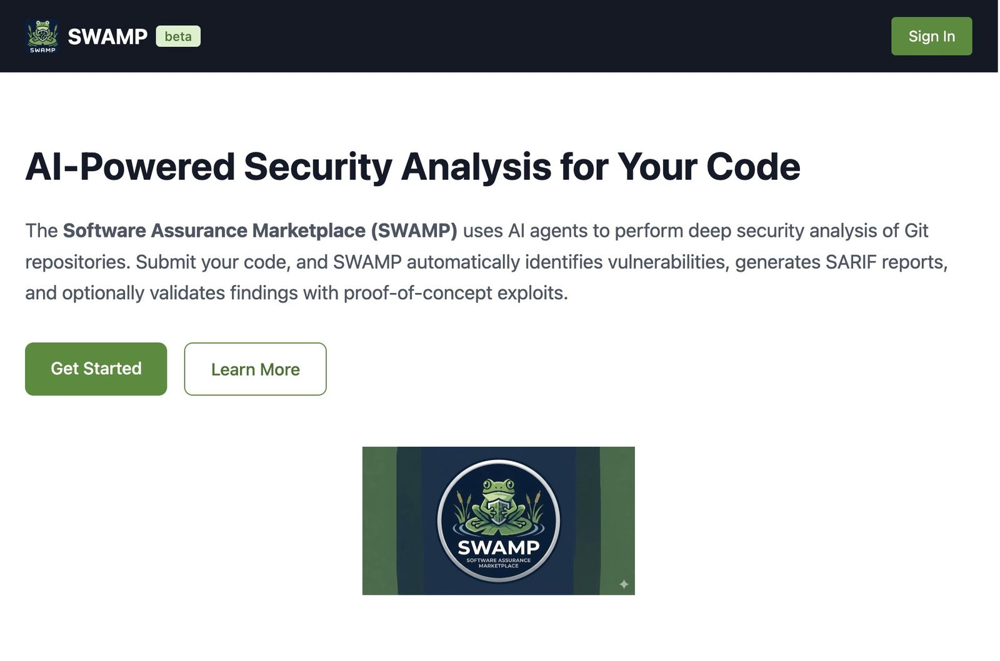

Click **Sign In**. This takes you to SWAMP's login page, which is just a
launch pad for the CILogon redirect; it does not collect any credentials
itself.

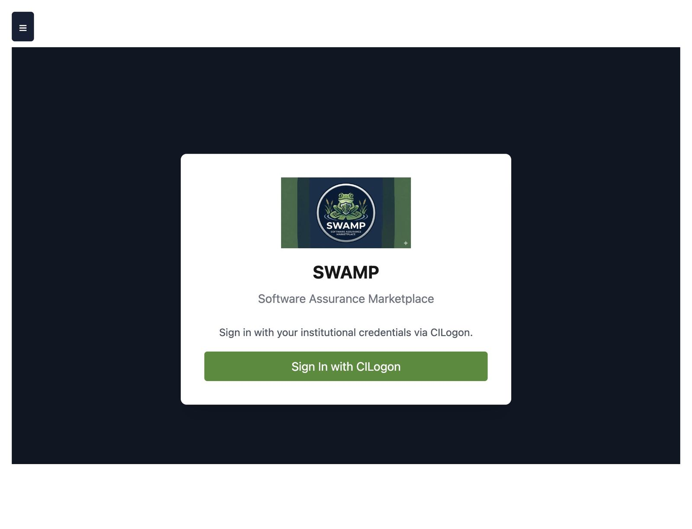

## 2. Complete CILogon authentication

Click **Log in with CILogon**. CILogon is a federated identity broker: you
pick _your_ institution or identity provider, authenticate there, and
CILogon hands a verified identity back to SWAMP. SWAMP never sees your
password.

1. Search for or select your identity provider (your university, ORCID,
   GitHub, etc.).
2. Click **Log On**.
3. Complete the login flow on your provider's site, including any
   multi-factor prompts.

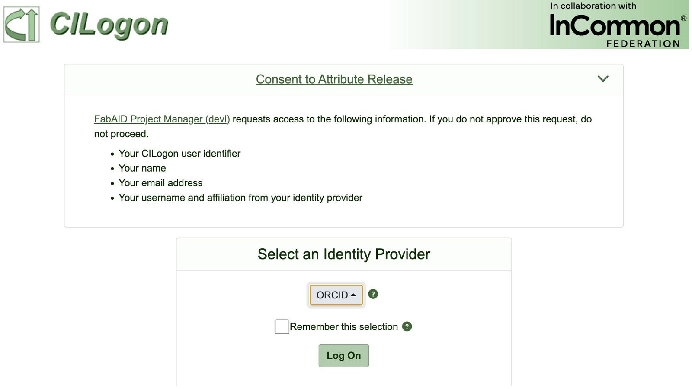

The first time you sign in, SWAMP will ask you to accept its Acceptable Use
Policy. This establishes that you understand SWAMP is a shared research
service and that you agree not to submit code or data you are not allowed
to share with it. Read it once, then click **I Agree**.

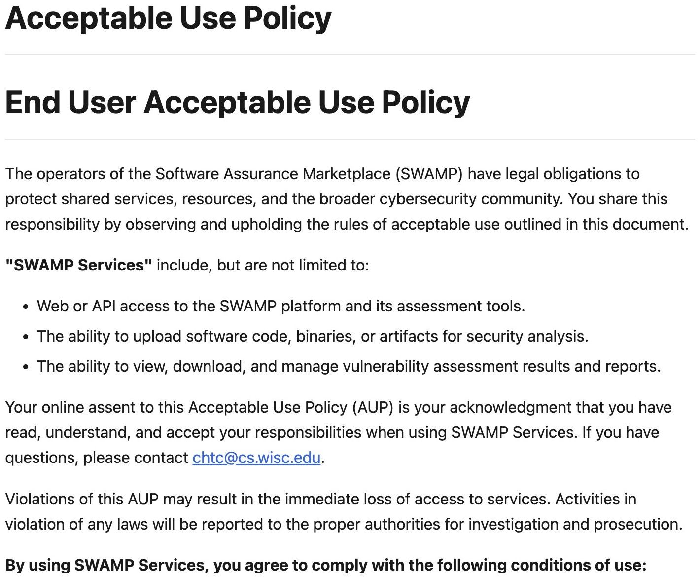

After acceptance you land on your personal dashboard. The dashboard is your
home base — it lists the projects you own or belong to and recent analysis
activity. A new account will be mostly empty.

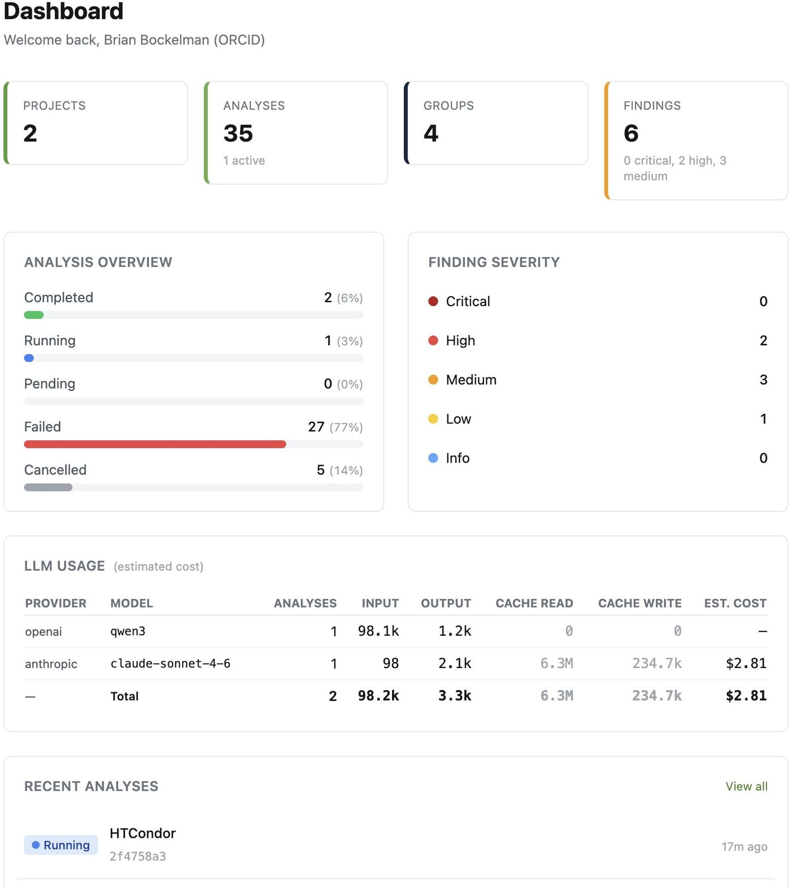

## 3. Create a new project

A **project** in SWAMP is a container for related packages and their
analyses. Grouping work into a project lets you share access with a team,
attach a provider key once for everything inside, and keep results
organized. For this tutorial we create a throwaway project just to hold the
vulnerable-app example.

1. Open **Projects** in the left navigation.
2. Click **+ New Project**.
3. Fill in:
   - **Project name:** `SWAMP Tutorial Vulnerable App`
   - **Description:** `Demo project for onboarding tutorial`
4. Leave **Auto-create groups** enabled. This creates an owner / member
   group pair for the project so you can invite collaborators later.
5. Click **Create**.

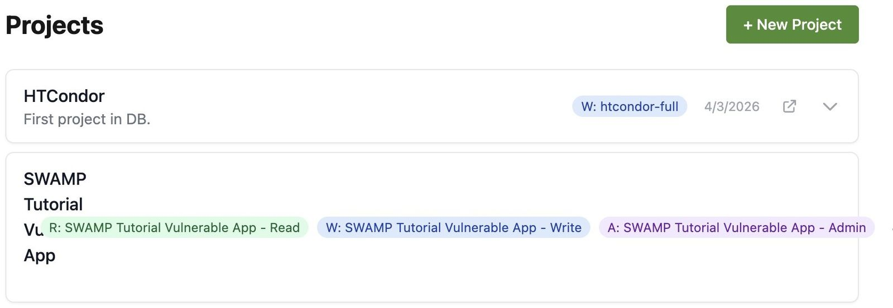

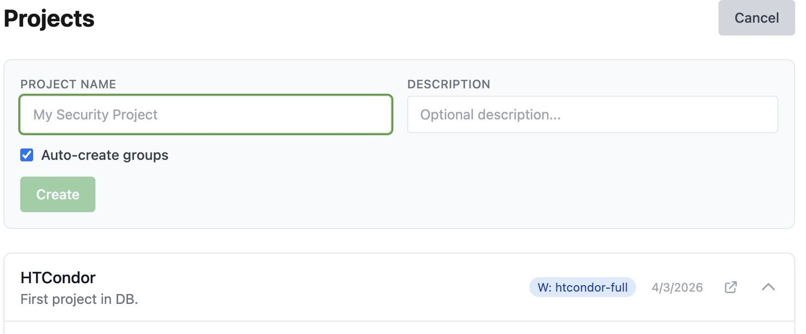

You are returned to the Projects list with your new project visible. Click
into it to open the project detail view, where the rest of the tutorial
happens.

## 4. Add the vulnerable-app package

A **package** is a specific Git repository (and optionally a branch or
commit) that you want SWAMP to analyze. You can have multiple packages in
one project — for example, a frontend repo and a backend repo that ship
together. Here we add a single package pointing at CHTC/vulnerable-app.

1. Inside the project, open the **Packages** tab.
2. Click **+ Add Package**.
3. Enter:
   - **Git URL:** `https://github.com/CHTC/vulnerable-app.git`
   - **Name:** `vulnerable-app`
   - **Branch:** leave blank to use the repository default, or specify
     `main` explicitly.
4. Click **Add**.

SWAMP does a lightweight verification of the Git URL at this stage to determine what branches are available; for private repos, this will prompt you to link a GitHub account so your private repo can be accessed by the application.

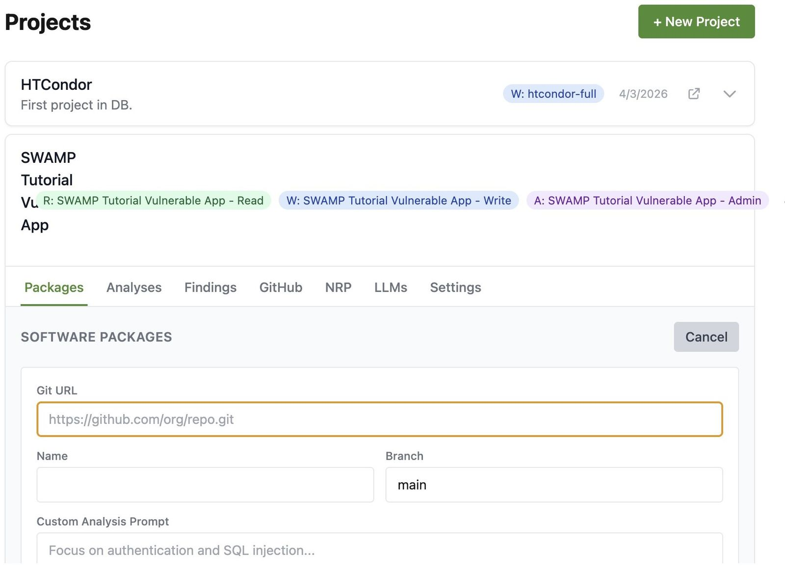

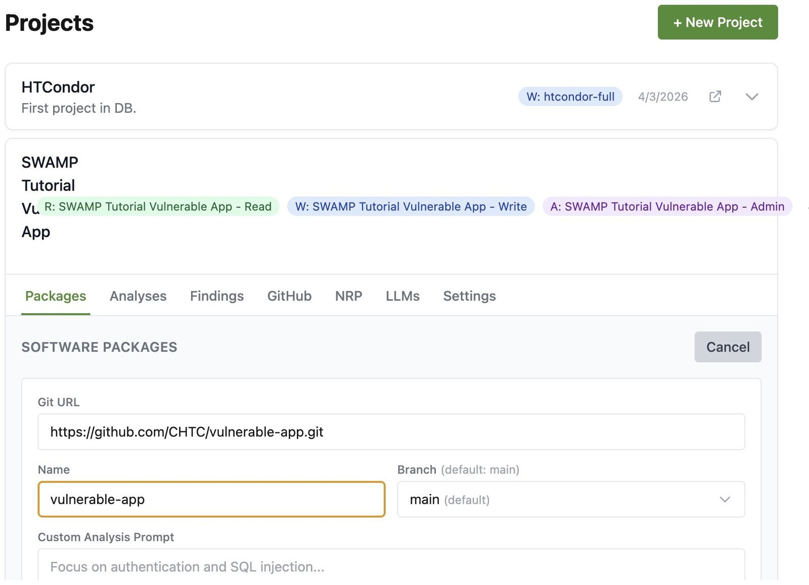

You should now see the package listed in the project.

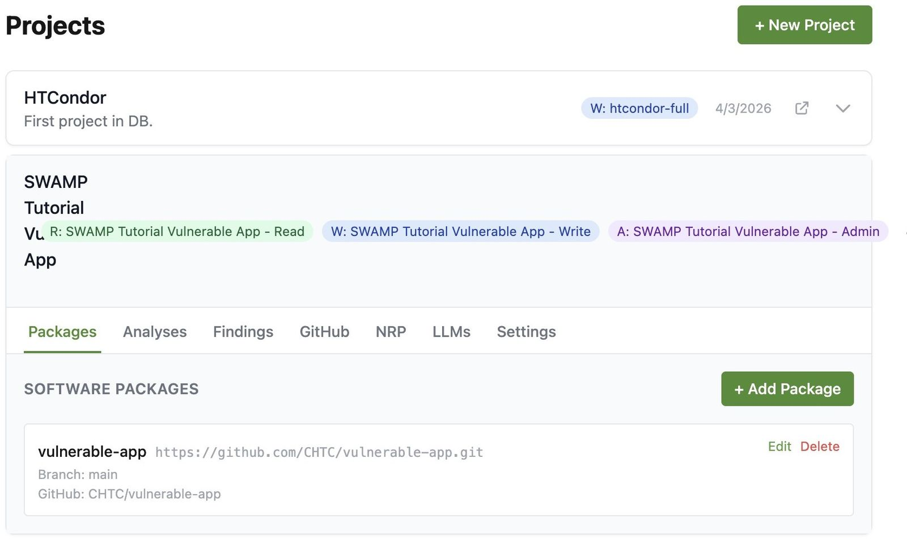

## 5. Run a sample analysis

Now that the project has a package, we can kick off an analysis. An
**analysis** is one end-to-end run of the AI agent against one or more
packages: SWAMP clones the code into an isolated workspace, the agent
explores the source, calls the configured LLM to reason about security
issues, and the resulting findings and artifacts are stored against this
analysis record.

### 5a. Configure an LLM provider (only if needed)

Analyses can only run when SWAMP has a usable LLM provider credential. If
you inherit one from a group, skip to 5b. Otherwise, the analyses tab will
show a _no providers available_ notice, and **Start Analysis** will be
disabled — this is the signal that you need to add a key first.

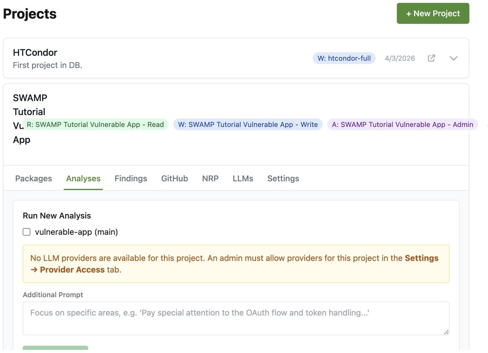

To add one:

1. Open the **LLMs** tab on the project.
2. Click **Add Key**.
3. Pick a provider (Anthropic, NRP ACCESS, Custom Endpoint, etc.) and paste
   in the key or token. The value is encrypted at rest — SWAMP never
   displays it again after it is saved.
4. Save the key.
5. Return to the **Analyses** tab; Start Analysis is now enabled and the
   provider's models show up in the model picker.

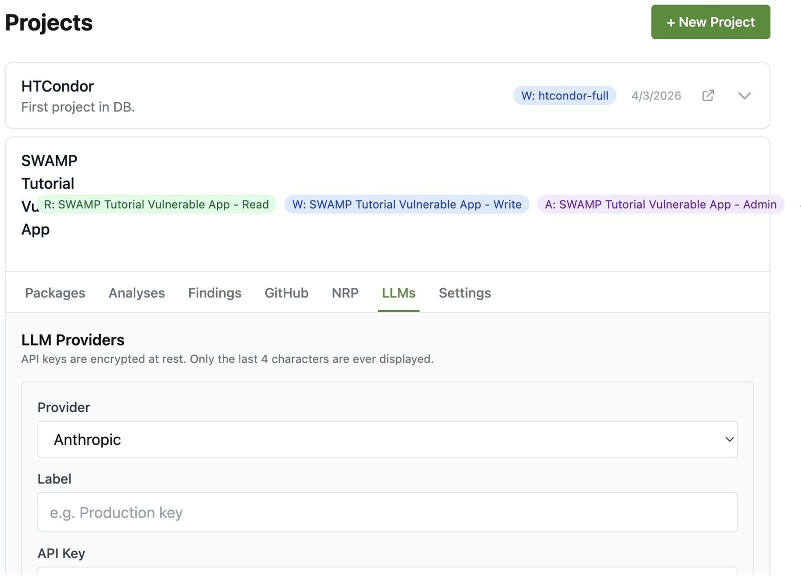

### 5b. Start the analysis

1. In the **Analyses** tab, check the box next to `vulnerable-app` to
   include it in the run. You can select multiple packages when a project
   has more than one.
2. Pick a model from the model list. Larger models generally find more
   subtle issues but cost more per run; any supported model works for this
   tutorial.
3. Optionally fill in **Additional Prompt**. This text is appended to the
   agent's base instructions and is useful for focusing the run (for
   example, _"Pay special attention to authentication and session
   handling."_). For the tutorial you can leave it blank.
4. Click **Start Analysis**.

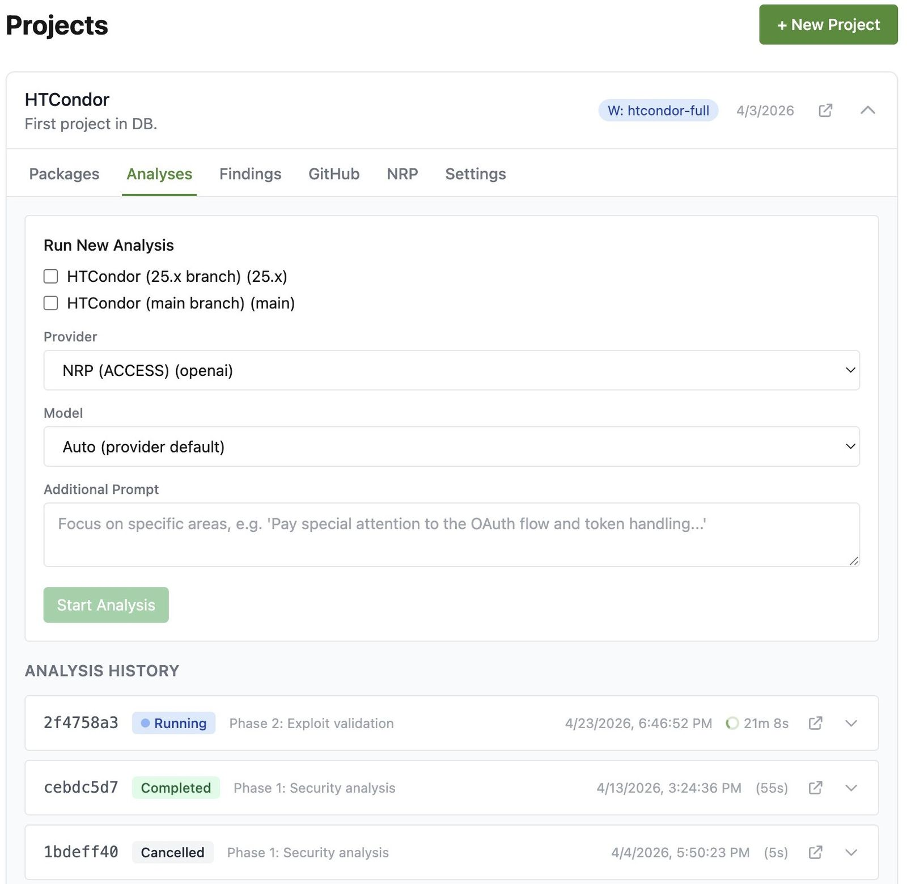

SWAMP queues the run and returns you to the analyses list, where the new
entry appears with a _Running_ status.

Click the running entry to open the detail view. Here you can watch phase
transitions (clone → analyze → finalize) and stream the agent's live
output. Keeping this page open is the easiest way to tell when the run is
done — the status badge updates in place without a reload.

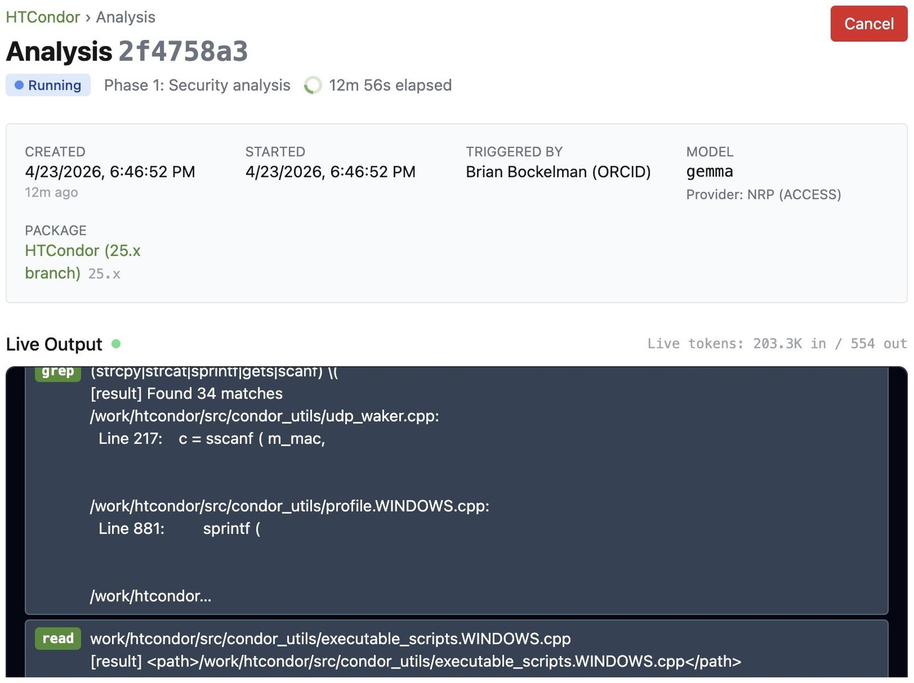

## 6. Review results

When the analysis completes, its detail page becomes a report:

1. The **phase status** at the top shows how long each stage took and
   whether any of them errored.
2. The **output log** is preserved so you can re-read the agent's
   reasoning.
3. The **Findings** tab lists every vulnerability the agent extracted,
   linked to the exact file and line in the cloned source.
4. The **Artifacts** section exposes machine-readable outputs —
   typically a [SARIF](https://sarifweb.azurewebsites.net/) file for
   importing into other tooling, and a Markdown summary report for
   humans.

For the vulnerable-app package you should see a healthy list of findings
covering common issues like injection and weak authentication — if you see
none, something went wrong with the run and the output log is the right
place to start debugging.

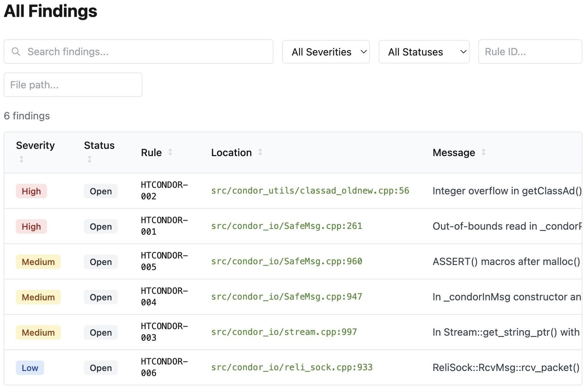

---

## Next steps

You now have a working end-to-end analysis. A few directions to take it
further:

- **Invite collaborators to the project.** Open the **Groups** page, pick
  the owner or member group that was auto-created with your project, and
  use **Invite** to send an email (or share a signup link) to teammates.
  Members can see findings and start their own analyses; owners can also
  manage packages, keys, and membership.
- **Integrate with GitHub.** Under your user **Settings → GitHub**,
  connect your GitHub account so SWAMP can access private repositories
  you own or collaborate on. Once linked, you can add private repos as
  packages the same way you added the public vulnerable-app, and SWAMP
  will reuse your GitHub credentials to clone them.
- **Use NRP / ACCESS for analysis compute.** If you have an account on
  the [National Research Platform](https://nationalresearchplatform.org/),
  link it under **Settings → NRP** and SWAMP will submit analysis jobs
  through your NRP allocation instead of (or in addition to) a direct
  LLM API key. This is the recommended path for researchers who already
  have an ACCESS allocation, because it charges compute against your
  allocation rather than a personal credit card.
- **Generate an API key for CI.** Under **Settings → API Keys**, create
  a token and point your CI system at SWAMP's REST API (see
  `/api/v1/openapi.yaml`) to kick off an analysis on every pull request
  and post findings back as a status check.
- **Pull SARIF into your editor / code host.** Every completed analysis
  exposes a SARIF artifact under **Artifacts**. Download it and load it
  into VS Code's SARIF viewer, or upload it to GitHub code scanning, to
  get inline annotations on the exact source lines.
- **Triage findings over time.** Under **Findings**, mark issues as
  *confirmed*, *false positive*, *mitigated*, or *won't fix*. Triage
  decisions persist across future analyses of the same package, so
  repeated runs surface only what's new or still open.
- **Tune the analysis with custom prompts.** Re-run the analysis with
  an **Additional Prompt** that focuses on a specific concern (e.g.
  *"Audit all database queries for injection and parameterization."*).
  Different models and different prompts will surface different issues;
  running a couple of complementary passes is a cheap way to improve
  coverage.

A final reminder: `CHTC/vulnerable-app` is intentionally insecure — use
it for demos only, never deploy it. And keep an eye on the LLM usage
table on your dashboard; every analysis consumes provider tokens against
the key (or NRP allocation) you configured.
