# Analyzing a Private GitHub Repository

> **Prerequisites:** Complete the [Getting Started tutorial](onboarding.md) first.
> This tutorial assumes you already have a SWAMP account, know how to create a
> project and package, and have run at least one analysis. The steps here focus
> exclusively on the GitHub integration that unlocks private repository access.

SWAMP can analyze any Git URL a clone command could reach. For public
repositories that is straightforward. For private GitHub repositories you need
to do two things: authorize SWAMP to read your GitHub identity (so it can
issue tokens on your behalf), and install the SWAMP GitHub App on the
organization or personal account that owns the private repository (so GitHub
trusts the clone requests). This tutorial walks through both steps and ends
with a completed analysis of a private repository.

By the end of the tutorial you will have:

- Your GitHub account linked to your SWAMP account
- The SWAMP GitHub App installed on the org or personal account that owns your
  private repository
- A project containing the private repository as a package
- A completed security analysis

## Prerequisites

- A SWAMP account (see the Getting Started tutorial if you do not have one).
- A GitHub account and at least one private repository you want to analyze.
- Owner or admin rights on the GitHub organization that owns the repository,
  **or** it is a personal repository under your own account. (If someone else
  owns the org, ask an org owner to install the App in step 2.)
- A project in SWAMP to put the package in — create one first if needed; the
  Getting Started tutorial covers this.

---

## 1. Link your GitHub account to SWAMP

SWAMP needs a GitHub OAuth token to clone private repositories on your behalf
and to verify which repos you have access to. You grant this once and it applies
to all of your projects.

1. Open your project in SWAMP and click the **GitHub** tab.

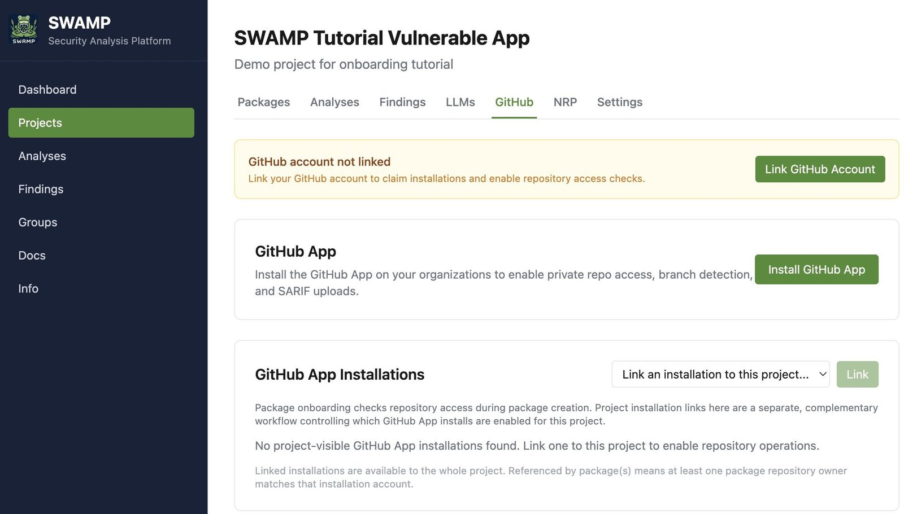

2. Click **Link GitHub Account**. GitHub will ask you to authorize SWAMP to
   read your identity and repository list. Click **Authorize** to proceed.
   SWAMP then shows a confirmation:

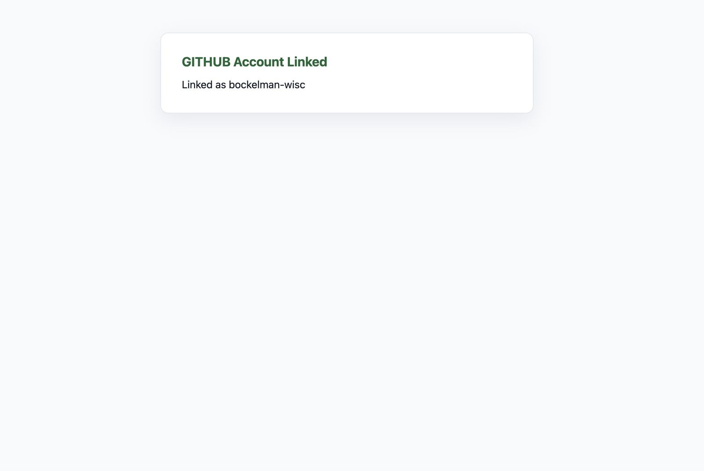

3. The popup closes and the tab refreshes. You should now see a green
   confirmation showing your GitHub username next to a checkmark.

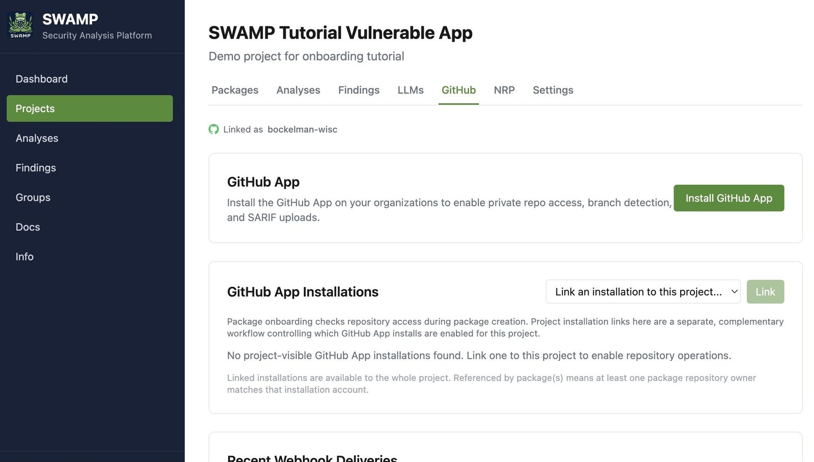

> **Why this step?** GitHub's OAuth flow proves to SWAMP that you are who you
> say you are on GitHub and issues a scoped token. SWAMP stores this token
> (encrypted at rest) and uses it when cloning private repositories that your
> account can access.

---

## 2. Install the SWAMP GitHub App on your organization

An OAuth token proves identity; it does not by itself allow SWAMP's backend
to clone repositories at scale. The GitHub App is a separate, more capable
credential: GitHub issues it a per-installation token that lets the App clone
any repository in the installation's scope. You must install it on every
organization (or personal account) whose private repos you want to analyze.

1. On the **GitHub** tab of your project, click **Install GitHub App**.
   This opens the GitHub App installation page in a new tab.

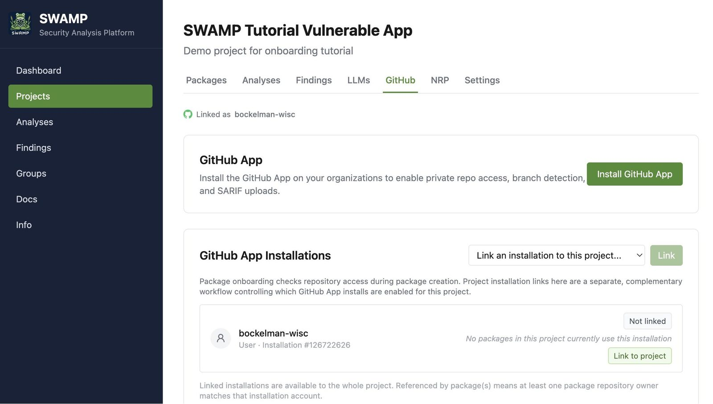

2. On GitHub, select the account or organization to install on, choose
   **All repositories** or select specific repositories, then click
   **Install**.

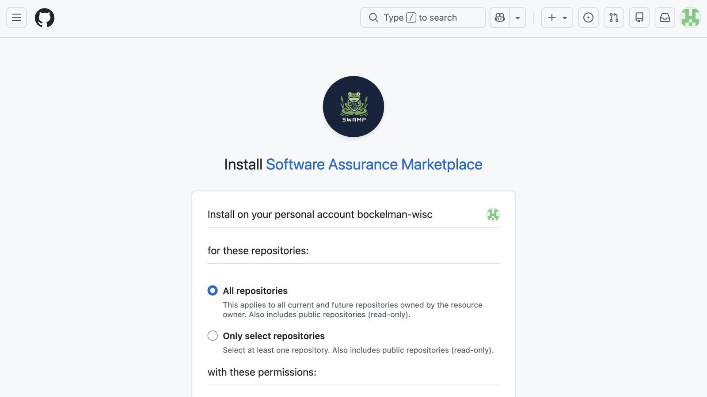

3. GitHub redirects back to SWAMP's callback URL, which records the
   installation. The tab closes (or shows a "Setup Complete" confirmation)
   and the project GitHub tab refreshes to show the new installation.

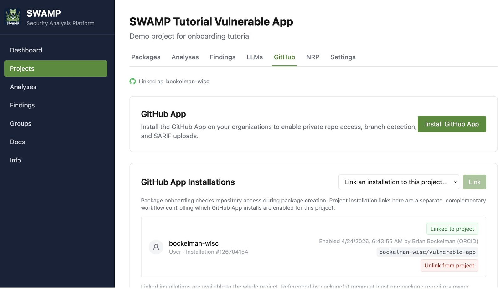

> **Org vs. personal account:** If the repository lives under an org you do not
> own, you will need to request the installation and wait for an org owner to
> approve it — GitHub will show a "request sent" message instead of completing
> immediately.

> **Scope guidance:** Selecting only the specific repositories you intend to
> analyze rather than "All repositories" is a good security practice. You can
> always update the installation scope later from GitHub's App settings page.

---

## 3. Add the private repository as a package

Now that SWAMP can clone your repository, add it to the project as a package
the same way you would a public repository. The difference is that SWAMP will
detect it is private via the GitHub App and automatically use the installation
token for cloning.

1. In your project, open the **Packages** tab and click **+ Add Package**.
2. Paste the HTTPS clone URL of your private repository, for example:
   `https://github.com/your-org/your-private-repo.git`
3. Give the package a name. The branch field will auto-populate from the
   GitHub API if your account is linked — select the branch you want to
   analyze, or leave blank to use the default branch.

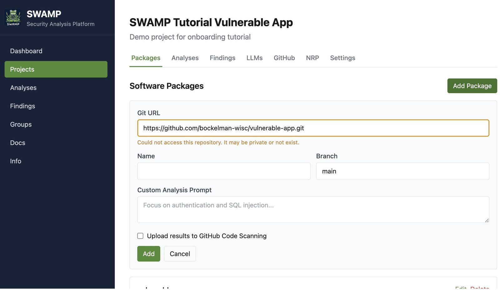

4. Click **Add**.

SWAMP performs an access check at this stage. If the check fails — for
example because the App is not installed on the org — you will see an error
message explaining why. Fix the installation (step 2) and retry.

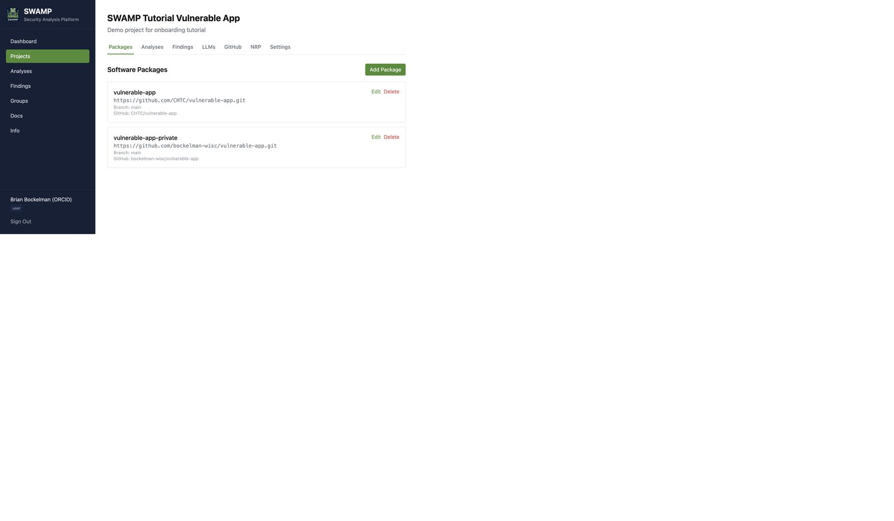

---

## 4. Run the analysis

Running an analysis on a private package works identically to a public one.
Return to the **Analyses** tab, check the package, choose a model, and click
**Start Analysis**.

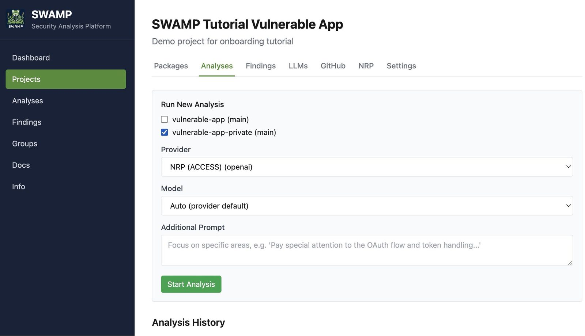

SWAMP uses the GitHub App installation token to clone the repository in the
isolated analysis environment. The analysis agent never has network access
beyond what is needed to clone and run the LLM calls, and the cloned source
is deleted when the run finishes.

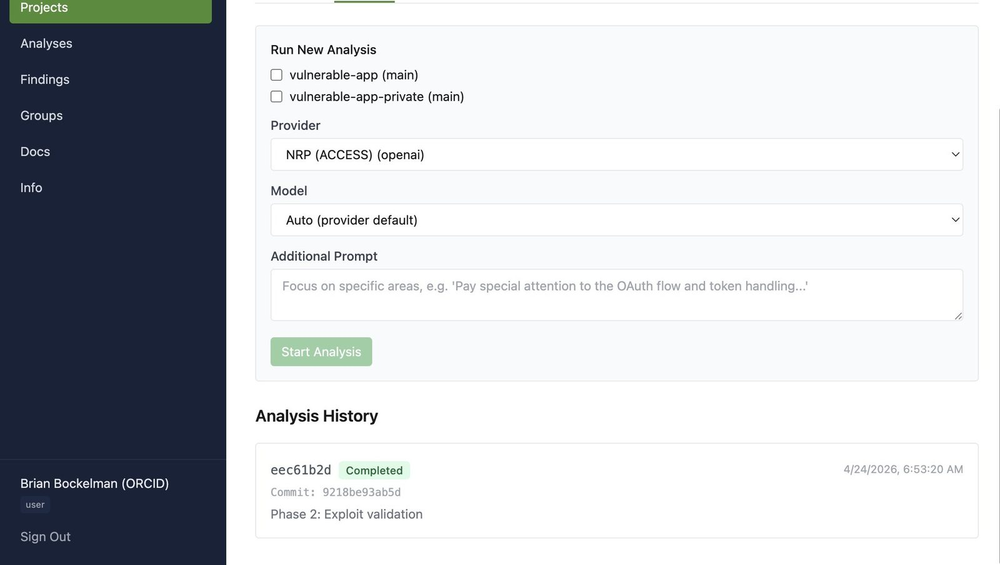

---

## 5. Review findings

Results look the same as for any other analysis — SARIF findings linked to
file and line, a Markdown summary report, and the agent's live output log.

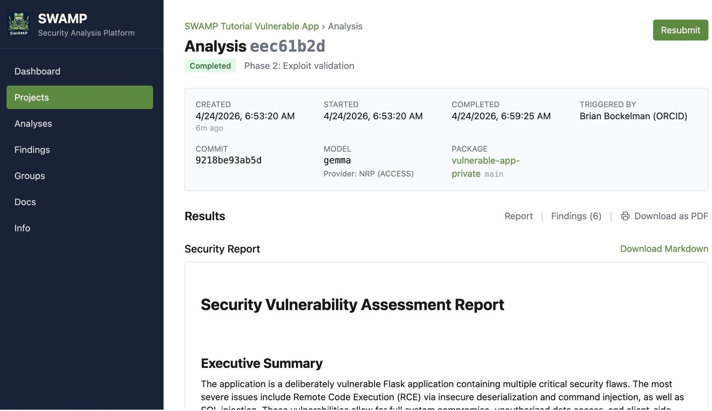

The only meaningful difference is that findings will reference paths in your
actual codebase rather than a toy example. Treat severity ratings as a triage
starting point: review **error** and **high** findings first, use
**Additional Prompt** on a re-run to focus on specific subsystems, and mark
issues as *confirmed*, *false positive*, or *mitigated* as you work through
them.

---

## Troubleshooting

**"Repository not found" or clone failure during analysis**

The App installation either does not cover this repository or was revoked.
Open the project's **GitHub** tab, confirm the installation is listed and
shows the repository in scope. If it is missing, re-run step 2.

**OAuth popup is blocked**

Your browser blocked the popup. Allow popups from `swamp.chtc.wisc.edu` in
your browser settings and click **Link GitHub Account** again.

**"Request sent to organization admin"**

You do not have owner rights on the org. The page will show this message and
the installation will be pending. Ask an org owner to approve it from
GitHub's **Settings → GitHub Apps** page, or use a personal fork of the
repository under your own account while you wait.

**Installation appears but analyses still fail to clone**

The GitHub App token may have expired or the installation may have been
suspended. Click **Sync Installations** on the GitHub tab (if present) to
refresh the token, or uninstall and reinstall the App.

---

## Next steps

- **Analyze multiple branches at once.** Add the same repository as two
  packages pointing at different branches (for example `main` and a release
  branch) and start a multi-package analysis to compare findings side by side.
- **Connect GitHub Actions for automatic analysis.** See the API Keys tutorial
  for how to call SWAMP's REST API from a GitHub Actions workflow so every
  pull request gets a security scan automatically.
- **Upload SARIF to GitHub code scanning.** Download the SARIF artifact from a
  completed analysis and upload it to GitHub's code scanning dashboard with
  `gh code-scanning upload-analysis` for inline PR annotations.
